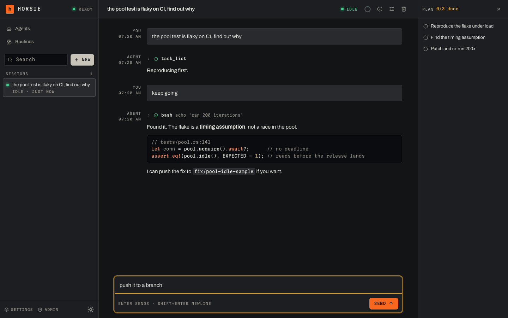

# horsie

**Self-hosted LLM agent sessions, in your browser.**

`horsie-server` is a web app for running LLM agents as durable chat
**sessions**. You open it in a browser, pick a model, and chat with an agent
that runs its tools in a **runtime** — a process on your own machine, or a
container the server creates per session. Every session is journaled
server-side and streams live to the browser, so you can close the tab,
reconnect, and pick up a run already in flight.

📖 **[docs.horsie.dev](https://docs.horsie.dev)** — guides, operations, CLI
reference, and how it works.



## Highlights

- **Durable, event-sourced sessions** — the whole transcript is journaled and
  replayed on reconnect. Stop a turn mid-run; nothing is lost.
- **Your models, your keys** — Anthropic and OpenAI-compatible providers, or a
  ChatGPT plan, configured from the Settings UI.
- **Tools run where you want** — `horsie connect` dials out from your own
  machine and works in the directories you expose, or a Fly Machines or velos
  vendor builds a fresh sandbox per session.
- **Real repositories** — connect a GitHub App once, then launch sessions with
  repos checked out into the runtime.
- **Extensible** — remote MCP servers and git-installed skill and plugin
  bundles, enabled per session.

## Quick start

```bash
docker compose -f docker/docker-compose.yml up -d
```

Server and web UI on port 3789, no external database and no config file; data
persists in a `horsie-data` Docker volume. Open <http://localhost:3789>, sign
in as `admin` with the password the first boot printed, and add a provider and
a model under **Settings → Models** — a fresh server has none, and sessions
cannot run a turn without one.

Then give sessions somewhere to run tools. On the machine holding the code you
want the agent to work on:

```bash
curl -fsSL https://get.horsie.dev | sh

horsie auth login --server http://localhost:3789
horsie connect --server http://localhost:3789 --workspace .
```

That registers the current directory and holds a connection open, spawning one
runtime process per session. Keep it running for as long as you want that
machine reachable — or configure a cloud vendor in Settings and skip it
entirely.

Back in the UI: **New** → pick a model and a runtime → send a message.

The full walkthrough is [the quickstart](https://docs.horsie.dev/start-here/quickstart/).

### Deploy it somewhere else

[](https://render.com/deploy?repo=https://github.com/blossomstack/horsie)

Runs the published image with a managed PostgreSQL database instead of a local
volume. Fly.io, an external PostgreSQL, and building the image yourself are all
covered in
[Deploying the server](https://docs.horsie.dev/operating/deploying/).

## Documentation

| | |
| --- | --- |
| [Quickstart](https://docs.horsie.dev/start-here/quickstart/) | From nothing to a running session |
| [Sessions](https://docs.horsie.dev/using/sessions/) | The chat view and per-session options |
| [Deploying the server](https://docs.horsie.dev/operating/deploying/) | Docker, Render, Fly, PostgreSQL, building from source |
| [The local runtime](https://docs.horsie.dev/operating/local-runtime/) | `horsie connect` on your own machine |
| [Cloud runtime vendors](https://docs.horsie.dev/operating/cloud-vendors/) | Fly Machines and velos, configured in Settings |
| [Configuration reference](https://docs.horsie.dev/operating/configuration/) | Every field, flag and environment variable |
| [CLI reference](https://docs.horsie.dev/cli/reference/) | Every command |
| [How it works](https://docs.horsie.dev/internals/sessions-and-durability/) | Durability, the vendor contract, agents, hooks |

The docs are built from `docs/` in this repository — see
[Writing docs](https://docs.horsie.dev/contributing/writing-docs/).

## Building from source

Requires a recent Rust toolchain, and bun for the web client.

```bash
make build-server     # ./target/release/horsie-server
make install-server   # install it into ~/.local/bin
make web-build        # build the web UI into clients/web/dist
make build-cli        # the `horsie` binary and its `horsie-runtime` child
make help             # every target
```

Run the binary directly with:

```bash
horsie-server --addr 0.0.0.0:3789 --web clients/web/dist
```

## Contributing

Pull requests are welcome. The pre-PR gate is `make check`. Contributors sign a
[CLA](https://github.com/blossomstack/.github/blob/main/CLA.md) so the project
can keep offering horsie under both licences below and adjust its licensing
later if it needs to.

See [CONTRIBUTING.md](CONTRIBUTING.md) and
[Developing horsie](https://docs.horsie.dev/contributing/developing/).

## License

Licensed under either of [Apache License, Version 2.0](LICENSE-APACHE) or
[MIT license](LICENSE-MIT) at your option.

Unless you explicitly state otherwise, any contribution intentionally submitted
for inclusion in horsie by you, as defined in the Apache-2.0 license, shall be
dual licensed as above, without any additional terms or conditions.
