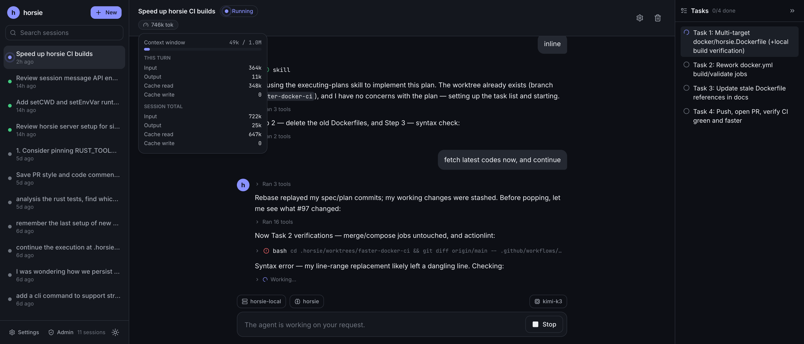

# horsie

**Self-hosted LLM agent sessions, in your browser.**

`horsie-server` is a web app for running LLM agents as durable chat **sessions**.
You open it in a browser, pick a model, and chat with an agent that runs its
tools in a **runtime** — a daemon on your own machine, or an ephemeral container
the server provisions. Every session is journaled server-side and streams live
to the browser, so you can close the tab, reconnect, and pick up a run already
in flight.



## Highlights

- **Durable, event-sourced sessions** — the whole transcript is journaled and
  replayed on reconnect. Stop a turn mid-run; nothing is lost.
- **Your models, your keys** — Anthropic and OpenAI-compatible providers,
  configured from the Settings UI.
- **Tools run where you want** — the `local` runtime dials back from your own
  machine and works in the directories you expose, or let `velos` provision a
  managed container per session.
- **Real repositories** — connect a GitHub App once, then launch sessions with
  repos checked out into the runtime.
- **Extensible** — remote MCP servers and git-installed skill/plugin bundles,
  enabled per session.

## Quick start

Start the server (from a checkout of this repo):

```bash
docker compose -f docker/docker-compose.yml up -d
```

That brings up the server and web UI on port 3789, with no external database and
no config file to write; data persists in a `horsie-data` Docker volume. Open
<http://localhost:3789> and add a provider + model under **Settings → Models** —
a fresh server has none, and sessions can't run a turn without one.

Then give sessions somewhere to run tools. On the machine holding the code you
want the agent to work on:

```bash
curl -fsSL https://get.horsie.dev | sh          # installs the `horsie` binary

horsie connect --server http://localhost:3789 --workspace .
```

This registers the current directory as a workspace and holds a connection to
the server, spawning one runtime process per session. Keep it running for as
long as you want that machine reachable. (Alternatively, configure a **velos**
vendor in Settings and skip the local daemon entirely.)

Back in the UI: **New** → pick a model → **Create**, and start chatting.

## How the pieces fit

```
 Browser (web UI)
    │  HTTP + SSE
    ▼
 horsie-server ──────────────► settings database (providers, models,
    │                          vendors, GitHub, MCP, skill bundles)
    │  runs each session's tools in a…
    ▼
 Runtime vendor
    ├─ local  — a `horsie connect` agent on your own machine, dialing back
    └─ velos  — a managed, ephemeral container the server provisions for you
```

Configuration is split in two, and the halves never overlap:

- **`config.json`** — deployment/bootstrap only: where data lives, which
  database, whether the local runtime is allowed. Edited by hand;
  `docker/docker-compose.yml` seeds it for you.
- **The settings database** (SQLite) — everything you tune day to day: providers
  and models, runtime vendors, GitHub, MCP servers, skill bundles. Edited from
  the **Settings** page in the UI.

> **No built-in authentication.** The server has no login or access control.
> Bind it to a trusted network only, or front it with your own auth proxy.

## Documentation

📖 **[Full user guide](docs/guide/README.md)** — running the server, runtime
vendors, sessions, GitHub, MCP, and skill bundles.

| Guide | For |
| --- | --- |
| [Getting started](docs/guide/getting-started.md) | Install the CLI, connect, run your first session |
| [Self-hosting](docs/guide/self-hosting.md) | Docker compose; building the image or binary yourself |
| [Runtime vendors](docs/guide/runtime-vendors.md) | Local daemon vs. velos; enabling each; picking one per session |
| [Sessions](docs/guide/sessions.md) | The chat view and per-session options |
| [GitHub](docs/guide/github.md) | Connect a GitHub App; run sessions against repos |
| [MCP servers](docs/guide/mcp-servers.md) | Connect remote MCP servers |
| [Skills & plugins](docs/guide/skills-and-plugins.md) | Install bundles; select them per session |
| [Settings reference](docs/guide/settings-reference.md) | `config.json` vs. the settings database; every field |

## Building from source

Requires a recent Rust toolchain (and Node for the web client).

```bash
make build-server     # ./target/release/horsie-server
make install-server   # install it into ~/.local/bin
make web-build        # build the web UI into clients/web/dist
```

Run the binary directly with:

```bash
horsie-server --addr 0.0.0.0:3789 --web clients/web/dist
```

`make build-cli` / `make install-cli` build the `horsie` binary (the vendor agent
behind `horsie connect`) and its sandboxed `horsie-runtime` child. `make help`
lists every target.

## Development

The pre-PR gate (also `make check`):

```bash
cargo fmt --check
cargo clippy --all-targets --all-features -- -D warnings
cargo test --workspace
```

Wire/protocol types are generated with
[fluorite](https://github.com/zhxiaogg/fluorite) from the schemas under
`models/fluorite/`. Production code denies `unwrap`, `expect`, `panic`, and
wildcard match arms; tests opt out per-file. See `CLAUDE.md` for the full design
philosophy and contribution conventions.

## License

MIT OR Apache-2.0.
