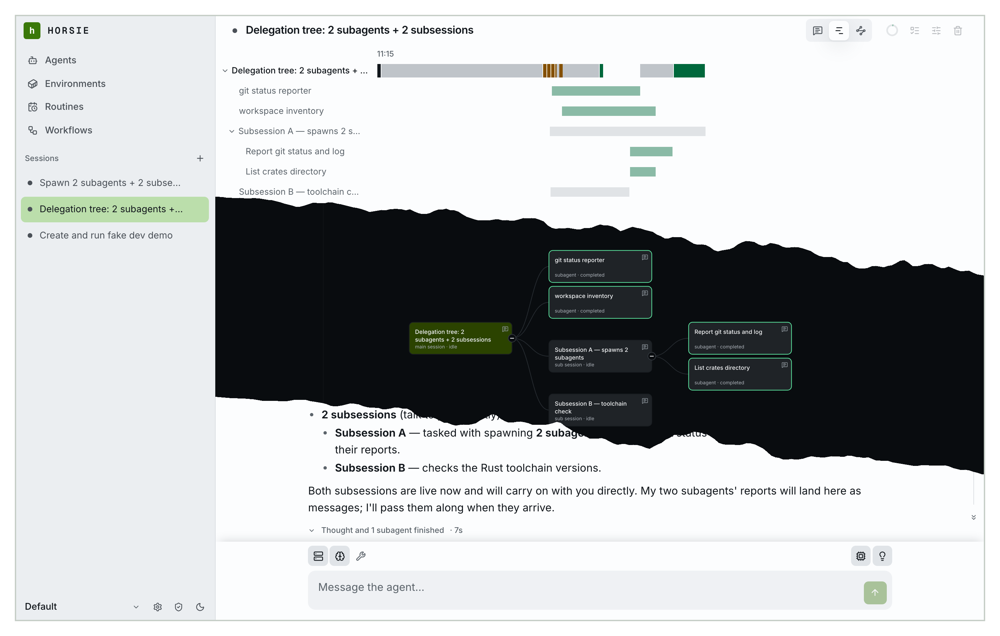

# horsie

**An open-source managed agent harness.**

The project is under active development.

📖 **[docs.horsie.dev](https://docs.horsie.dev)** — guides, operations, CLI
reference, and how it works.

[](https://youtu.be/saoVBeuFrT4)

▶ **[Watch the two-minute walkthrough](https://youtu.be/saoVBeuFrT4)** — a session
end to end, a sandbox on your own machine, and an agent building a workflow that
another agent then runs.

## Quick start

```bash
docker compose -f docker/docker-compose.yml up -d
```

Server and web UI on port 3789, no external database and no config file; data
persists in a `horsie-data` Docker volume. Open <http://localhost:3789>, sign
in as `admin` with the password the first boot printed, and add a provider and
a model under **Settings → Models** — a fresh server has none, and sessions
cannot run a turn without one.

Then give it a sandbox. On the machine holding the code you want the agent to
work on:

```bash
curl -fsSL https://get.horsie.dev | sh

horsie auth login --server http://localhost:3789
horsie connect --server http://localhost:3789 --workspace .
```

That registers the current directory and holds a connection open, dialling
*out*, so there is no port to open. It spawns one sandbox per session. Keep it
running for as long as you want that machine reachable — or configure a cloud
vendor in Settings and skip it entirely.

Back in the UI: **New** → pick a model and a sandbox → send a message.

The full walkthrough is [the quickstart](https://docs.horsie.dev/start-here/quickstart/).

### Deploy it somewhere else

[](https://render.com/deploy?repo=https://github.com/blossomstack/horsie)

Runs the published image with a managed PostgreSQL database instead of a local
volume. Fly.io, an external PostgreSQL, and building the image yourself are all
covered in
[Deploying the server](https://docs.horsie.dev/operating/deploying/).

## Building from source

Requires a recent Rust toolchain, and bun for the web client.

```bash
make build-server     # ./target/release/horsie-server
make install-server   # install it into ~/.local/bin
make web-build        # build the web UI into clients/web/dist
make build-cli        # the `horsie` binary and its `horsie-runtime` child
make help             # every target
```

Run the binary directly with:

```bash
horsie-server --addr 0.0.0.0:3789 --web clients/web/dist
```

## Contributing

Pull requests are welcome. The pre-PR gate is `make check`. Contributors sign a
[CLA](https://github.com/blossomstack/.github/blob/main/CLA.md) so the project
can keep offering horsie under both licences below and adjust its licensing
later if it needs to.

See [CONTRIBUTING.md](CONTRIBUTING.md) and
[Developing horsie](https://docs.horsie.dev/contributing/developing/).

## License

Licensed under either of [Apache License, Version 2.0](LICENSE-APACHE) or
[MIT license](LICENSE-MIT) at your option.

Unless you explicitly state otherwise, any contribution intentionally submitted
for inclusion in horsie by you, as defined in the Apache-2.0 license, shall be
dual licensed as above, without any additional terms or conditions.
