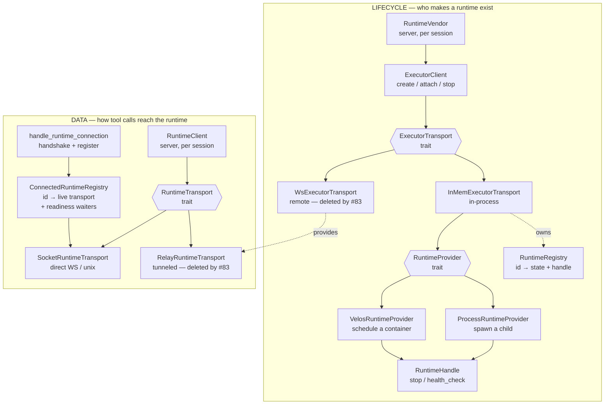
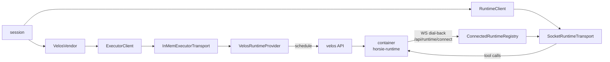
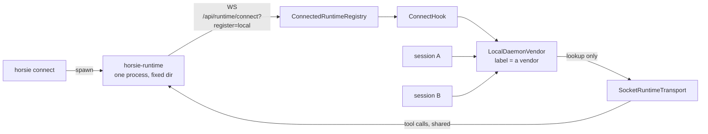
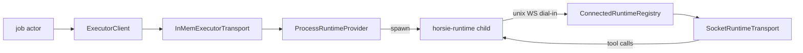
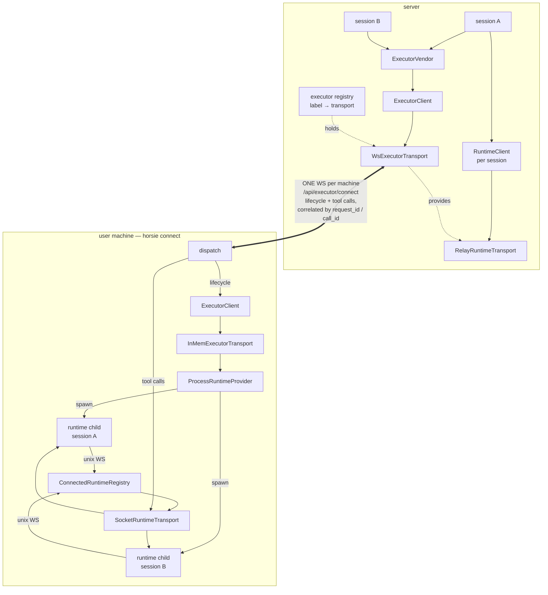
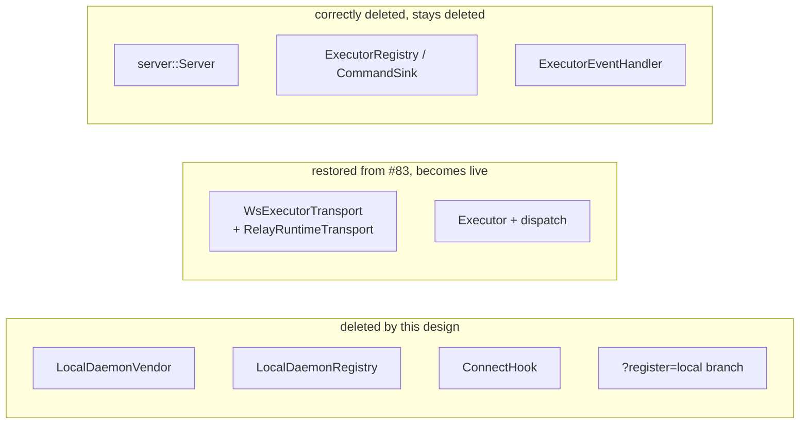

# Per-session local runtimes — diagrams

Paste any block below into Excalidraw: hamburger menu → Import → Mermaid.

## 1. The two chains

Every path is a **lifecycle** chain (who makes a runtime exist) plus a **data**
chain (how tool calls reach it). They are independent.

## 2. Wiring today — velos

Provider on the server; tool calls go straight to the container.

## 3. Wiring today — local (no lifecycle at all)

`horsie connect` spawns one runtime that registers *itself* as a vendor.
Nothing creates runtimes; `create`/`attach` are lookups, `stop`/`delete` are no-ops.

## 4. Wiring today — CLI workflow jobs

In-process lifecycle, children on a unix socket. This is the shape the new
design reuses on the user's machine.

## 5. Target design — one WS per machine, children behind the executor

Wiring 4 on the user's machine, driven remotely through wiring 1's transport.
The server-facing connection belongs to the executor, so it survives killing and
respawning any child behind it — that is what makes hibernate/resume possible.

## 6. What the design removes

